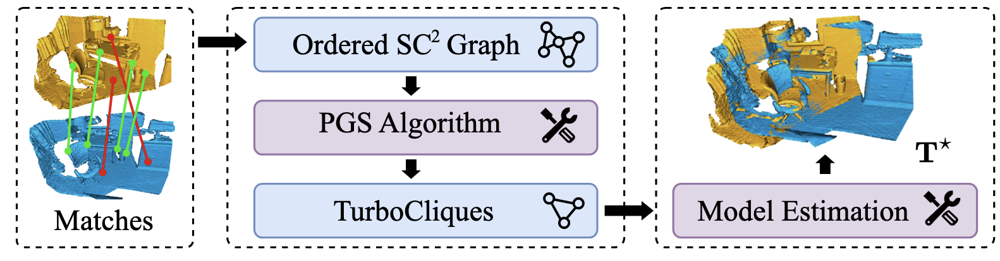

<div align="center">

 

---

  <a href="https://arxiv.org/pdf/2507.01439" target="_blank" rel="noopener noreferrer">
    
  </a>
  <a href="https://arxiv.org/abs/2507.01439">
    
  </a>
  <a href="https://www.bilibili.com/video/BV1atbSzJEdv?t=158.1">
    
  </a>


  <a href="https://laka-3dv.github.io/">Shaocheng Yan</a> &nbsp;
  <a href="https://shipc-ai.github.io/">Pengcheng Shi</a><sup>†</sup> &nbsp;
  <a href="https://ericzzj1989.github.io/">Zhenjun Zhao</a> &nbsp;
  Kaixin Wang &nbsp;
  Kuang Cao &nbsp;
  Ji Wu &nbsp;
  <a href="https://ljy-rs.github.io/web/">Jiayuan Li</a><sup>†</sup>

<p align="center">
  <a href="https://arxiv.org/abs/2507.01439">
    <!--  -->
    
  </a>
  <br>
  <em>A highly efficient and robust estimator for point cloud registration (PCR), supporting both CPU and GPU platforms.</em>
</p>


</div>


## 🌀 Overview


**TurboReg** is a highly efficient and robust estimator for point cloud registration (PCR), supporting both **CPU** and **GPU** platforms. It achieves **60+ FPS** while maintaining state-of-the-art registration recall.

**Highlights**
* State-of-the-art performance on 3DMatch and KITTI datasets
* Efficient runtime (60+ FPS)
* Learning-free, parameter-friendly design


Here's a general comparison of TurboReg with existing methods:

<div align="center">


### Comparison with Existing Methods

| **Method Name** | **Venue (Year)** | **Performance (Recall)** | **CPU Efficiency** | **GPU Efficiency** |
|------------------|------------------|:------------------------:|:------------------:|:------------------:|
| SC2-PCR          | CVPR 2022        | ✅                        | ❌                  | ✅                  |
| MAC              | CVPR 2023        | ✅                        | ❌                  | ❌                  |
| FastMAC          | CVPR 2024        | ❌                        | ✅                  | ✅                  |
| **TurboReg**  🎖  | **ICCV 2025**    | ✅                        | ✅                 | ✅             (60+FPS)     |


</div>


---

## 📦 Installation

### Python API

> Note: The Python API of TurboReg is implemented in C++ and exposed via PyBind11, offering C++-level performance within Python.

Create a Python virtual environment and install PyTorch (with CUDA support):

```bash
# Python Enviroment
git clone https://github.com/Laka-3DV/TurboReg.git
cd TurboReg

conda create -n turboreg python=3.11
conda activate turboreg

pip install open3d tyro

# Install PyTorch (select the appropriate version for your CUDA setup from https://pytorch.org/)
pip3 install torch torchvision torchaudio --index-url https://download.pytorch.org/whl/cu118
````
Install TurboReg by running:

```bash
cd bindings
pip install .
cd ..
```

You can try TurboReg with just a few lines of code:


```python
import numpy as np
import torch
import turboreg_gpu  # NOTE: torch must be imported before turboreg_gpu

# Load input correspondences
kpts_src = torch.from_numpy(np.loadtxt('demo_data/000_fpfh_kpts_src.txt')).cuda().float()
kpts_dst = torch.from_numpy(np.loadtxt('demo_data/000_fpfh_kpts_dst.txt')).cuda().float()

# Initialize TurboReg with specific parameters:
reger = turboreg_gpu.TurboRegGPU(
    6000,      # max_N: Maximum number of correspondences
    0.012,     # tau_length_consis: \tau (consistency threshold for feature length/distance)
    2000,      # num_pivot: Number of pivot points, K_1
    0.15,      # radiu_nms: Radius for avoiding the instability of the solution
    0.1,       # tau_inlier: Threshold for inlier points. NOTE: just for post-refinement (REF@PointDSC/SC2PCR/MAC)
    "IN"       # eval_metric: MetricType (e.g., "IN" for Inlier Number, or "MAE" / "MSE")
)

# Run registration
trans = reger.run_reg(kpts_src, kpts_dst)
```

To run the demo:

```bash
cd ./demo_py
python o3d_fpfh.py
```


### C++ Build Instructions

#### 🔧 Dependencies

* CMake ≥ 3.10
* LibTorch (No independent installation required; use directly within your Python virtual environment (i.e., turboreg))

> GPU version uses **LibTorch** from the Python virtual environment.
> For CPU version, you can refer to [`./turboreg_cpu/`](./turboreg_cpu/) (TBD).


```bash
mkdir build_ && cd build_ 
cmake .. -DCMAKE_PREFIX_PATH=`python -c "import torch; print(torch.utils.cmake_prefix_path)"`
make -j8

# Run C++ demo
./demo_cpp/demo_corr_fpfh
```

---

## 🧪 Experiment Reproduction

Download the processed 3DMatch correspondences from [MAC++](https://github.com/zhangxy0517/MAC-PLUS-PLUS?tab=readme-ov-file#datasets). Expected folder structure:

```sh
DIR_3DMATCH_FPFH_FCGF
.
├── 3DMatch
│   ├── all_fcgf
│       ├── 7-scenes-redkitchen
│       └── ...
│   └── all_fpfh
│       ├── 7-scenes-redkitchen
│       └── ...
```

Then, run the folloing script 

```python
# For 3DMatch + FPFH
python -m demo_py.exp_3dmatch --desc fpfh --dataname 3DMatch --dir_dataset "DIR_3DMATCH_FPFH_FCGF" --max_N 7000 --tau_length_consis 0.012 --num_pivot 2000 --radiu_nms 0.15 --tau_inlier 0.1 --metric_str "IN"

# For 3DMatch + FCGF
python -m demo_py.exp_3dmatch --desc fcgf --dataname 3DMatch --dir_dataset "DIR_3DMATCH_FPFH_FCGF" --max_N 6000 --tau_length_consis 0.012 --num_pivot 2000 --radiu_nms 0.10 --tau_inlier 0.1 --metric_str "MAE"
```


## 📈 Registration Performance (RR ↑, RE ↓, TE ↓, FPS ↑)


<div align="center">

| Dataset   | Descriptor | RR (%) | RE (°) | TE (cm) | FPS   |
| --------- | ---------- | ------ | ------ | ------- | ----- |
| 3DMatch   | FPFH       | 84.10  | 2.19   | 6.81    | 52.87 |
| 3DMatch   | FCGF       | 93.59  | 2.04   | 6.42    | 64.55 |
| 3DMatch   | Predator   | 94.89  | 2.07   | 6.04    | 63.31 |
| 3DLoMatch | FPFH       | 40.99  | 3.85   | 10.16   | 62.31 |
| 3DLoMatch | FCGF       | 59.74  | 3.76   | 10.40   | 61.43 |
| 3DLoMatch | Predator   | 73.07  | 3.28   | 9.53    | 67.68 |
| KITTI     | FPFH       | 98.56  | 0.47   | 8.96    | 68.93 |
| KITTI     | FCGF       | 98.38  | 0.40   | 8.12    | 67.81 |

</div>

## 📖 Citation

If you find this code useful for your work or use it in your project, please consider citing:
```
@article{yan2025turboreg,
  title={TurboReg: TurboClique for Robust and Efficient Point Cloud Registration},
  author={Yan, Shaocheng and Shi, Pengcheng and Zhao, Zhenjun and Wang, Kaixin and Cao, Kuang and Wu, Ji and Li, Jiayuan},
  journal={arXiv preprint arXiv:2507.01439},
  year={2025}
}
```

## 🙏 Acknowledgements

TurboReg builds upon several excellent open-source works:

* [XuyangBai/PointDSC](https://github.com/XuyangBai/PointDSC)
* [ZhiChen902/SC2-PCR](https://github.com/ZhiChen902/SC2-PCR)
* [zhangxy0517/3D-Registration-with-Maximal-Cliques](https://github.com/zhangxy0517/3D-Registration-with-Maximal-Cliques)