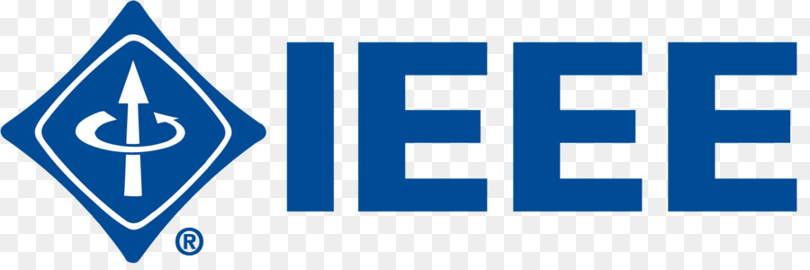
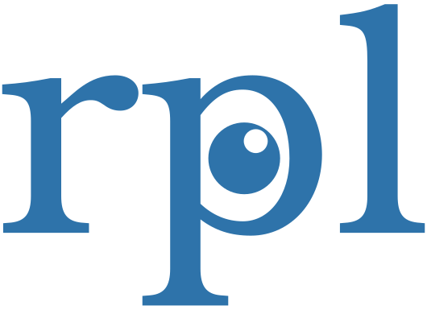
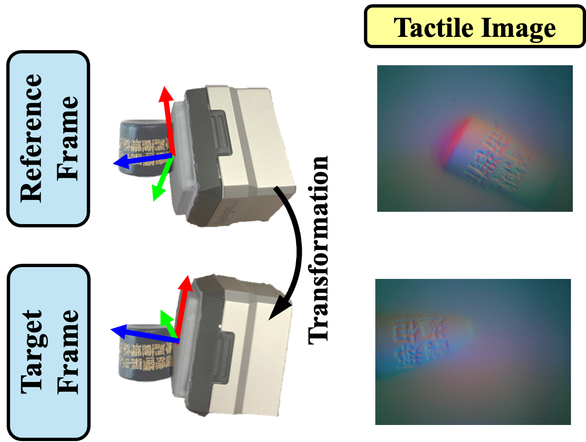

<h1 align="center">
    NormalFlow: Fast, Robust, and Accurate <br/> Contact-based Object 6DoF Pose Tracking <br/> with Vision-based Tactile Sensors
</h1>

<div align="center">
  <a href="https://joehjhuang.github.io/" target="_blank">Hung-Jui Huang</a> &nbsp;•&nbsp;
  <a href="https://www.cs.cmu.edu/~kaess/" target="_blank">Michael Kaess</a> &nbsp;•&nbsp;
  <a href="https://siebelschool.illinois.edu/about/people/all-faculty/yuanwz" target="_blank">Wenzhen Yuan</a>
</div>

<h4 align="center">
  <a href="https://joehjhuang.github.io/normalflow"> <b>Website</b></a> &nbsp;&nbsp;&nbsp;&nbsp;
  <a href="https://ieeexplore.ieee.org/document/10766628"> <b>Paper</b></a> &nbsp;&nbsp;&nbsp; &nbsp;
  🤗 <a href="https://huggingface.co/datasets/joehjhuang/TactileTracking"> <b>Dataset</b></a>
</h4>


<div align="center">
<br>

[](https://opensource.org/licenses/MIT) &nbsp; 
<a href="https://rpl.ri.cmu.edu/" target="_blank">
  
</a>
</div>

<p align="center">
  
</p>

NormalFlow is a tactile-based object tracking algorithm that is significantly more accurate and robust compared to other approaches and performs well even on low-textured objects like a table tennis ball, an egg or a flat table. It operates at 70 Hz on a standard CPU. For additional details and results, please visit our [website](https://joehjhuang.github.io/normalflow) and the [RA-L paper](https://ieeexplore.ieee.org/document/10766628). 


## Support System
* Tested on Ubuntu 22.04
* Tested on GelSight Mini and Digit
* Python >= 3.9
* For the demo and example, install [gs_sdk](https://github.com/joehjhuang/gs_sdk).

## Installation
Clone and install normalflow from source:
```bash
git clone git@github.com:rpl-cmu/normalflow.git
cd normalflow
pip install -e .
```

## Real-time Demo

<p align="center">
  
  <br>
  <em>Real-time tracking demo, filmed live without post-processing </em>
</p>

Connect a GelSight Mini sensor (without markers) to your machine and run the command below to start a real-time object tracking demo.
```bash
realtime_object_tracking [-d {cpu|cuda}]
```

After starting, wait a few seconds for a window to appear. Tracking will begin once an object contacts the sensor. Press any key to exit.

* Note: By default, the demo uses the OpenCV streamer, which often reduces GelSight Mini’s frame rate to ~10 Hz (vs. 25 Hz). For tracking low-textured objects like a ping pong ball, 25 Hz may be needed. Using the FFMPEG streamer by adding the `-s ffmpeg` flag to the command can restore the 25 Hz frame rate. However, we observe that on some systems, the FFMPEG streamer can introduce severe frame delay and duplication.
* Note: For other GelSight sensors, please use the [GelSight SDK](https://github.com/joehjhuang/gs_sdk) Calibration tool to calibrate. Supply the configuration file and calibrated model path as arguments to run the demo with other GelSight sensors.
* Note: This demo also serves as an implementation of the long-horizon tracking algorithm presented in the [RA-L paper](https://ieeexplore.ieee.org/document/10766628).

## Examples
This example demonstrates basic usage of NormalFlow. Run the command below to test the tracking algorithm.
```bash
test_tracking [-d {cpu|cuda}]
```
The command reads the tactile video `examples/data/tactile_video.avi`, tracks the touched object, and saves the result in `examples/data/tracked_tactile_video.avi`.

## Documentation
The `normalflow` function in `normalflow/registration.py` implements frame-to-frame NormalFlow tracking, returning the homogeneous transformation from a reference sensor frame to a target sensor frame (see figure below). If tracking fails, it raises `InsufficientOverlapError`. For usage, see `examples/test_tracking.py` and `demos/realtime_object_tracking.py`.

<p align="center">
  <br>
  
  <br>
</p>

## Reproduce Paper Results
To reproduce the main results from our [paper](https://ieeexplore.ieee.org/document/10766628), which compares NormalFlow with baseline algorithms, please visit the [NormalFlow Experiment](https://github.com/rpl-cmu/normalflow_experiment) repository.

## Cite NormalFlow
If you find this package useful, please consider citing our paper:
```
@ARTICLE{huang2024normalflow,
    author={Huang, Hung-Jui and Kaess, Michael and Yuan, Wenzhen},
    journal={IEEE Robotics and Automation Letters}, 
    title={NormalFlow: Fast, Robust, and Accurate Contact-based Object 6DoF Pose Tracking with Vision-based Tactile Sensors}, 
    year={2024},
    volume={},
    number={},
    pages={1-8},
    keywords={Force and Tactile Sensing, 6DoF Object Tracking, Surface Reconstruction, Perception for Grasping and Manipulation},
    doi={10.1109/LRA.2024.3505815}}
```
